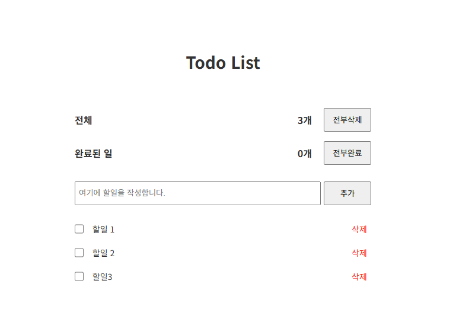

# 플랜잇스퀘어 프론트엔드 기술과제 설명 문서

> 순수 자바스크립트를 이용하여 웹 컴포넌트를 구현하고, todoList 기능을 만든 프로젝트입니다.
>
> 사용기술 : javascript, CSS



## 1. 폴더 구조

```
📜index.js
📜index.html
📦src
 ┣ 📂components
 ┃ ┣ 📜Form.js
 ┃ ┣ 📜Head.js
 ┃ ┗ 📜TodoList.js
 ┣ 📂model
 ┃ ┗ 📜model.js
 ┣ 📂style
 ┃ ┗ 📜style.css
 ┣ 📂util
 ┃ ┗ 📜util.js
 ┗ 📜App.js
```

## 2. 폴더별 설명

| 폴더명         | 폴더 설명                                                                       |
| -------------- | ------------------------------------------------------------------------------- |
| src/components | App.js 내부에 들어가는 컴포넌트 폴더입니다.                                     |
| src/model      | App.js 및 component의 기본 파라미터와 구조를 정의했습니다.                      |
| src/style      | 스타일링 css 파일이 있는 폴더입니다.                                            |
| src/util       | App.js를 포함하여 모든 컴포넌트에서 공용으로 사용하는 함수를 분리한 폴더입니다. |

## 3. 프로젝트 설계

> VScode 의 Live Server Extension을 이용해 개발서버를 사용합니다.

### index.js

```javascript
import App from "./src/App.js";

new App({ $container: document.querySelector("#app") });
```

최상단의 `App`컴포넌트를 생성하는 모듈입니다.

### 라이프사이클

`App`을 포함한 컴포넌트들은 기본적으로 이 순서에 따라 함수를 실행합니다.

> 1.  `this.setup()` 상태(변수) 정의
> 2.  `this.setState()` 상태 세팅
> 3.  `this.templete()` 템플릿 생성
> 4.  `this.render()` 템플릿 렌더링
> 5.  `this.addEvent()` 생성된 HTML 엘리먼트에 이벤트 추가

이후 하위 컴포넌트에서 상태를 변경하는 이벤트가 일어났을 경우, 최상단에서 파라미터로 전달하는 `setParentState()`함수를 통해 컴포넌트를 리렌더링합니다. 예시를 들면 아래와 같습니다.

#### 예시

> src/components/Form.js

```javascript
// 할일 추가 핸들러
const submitNewData = (event) => {
  const addText = document.querySelector("#addText");
  if (addText.value == "") return event.preventDefault();
  event.preventDefault();
  const newData = {
    id: createDataId(),
    name: addText.value,
    isCompleted: false,
  };
  this.state.todoList.push(newData);
  saveList(this.state.todoList);
  addText.value = "";
  setParentState(); //todoList 데이터 변경 후 컴포넌트 리렌더링
};
```

## 4. 기능 구현사항

#### 1. 할일(이하 `todo`로 명시) 추가 및 저장

- `input`에 내용을 입력합니다.
- '추가' 버튼 클릭, 혹은 엔터키를 칠 경우 할일 목록(이하 `todoList`로 명시)이 추가됩니다.
- 내용을 아무것도 입력하지 않을 경우 `todo`는 추가되지 않습니다.
- 등록된 `todo`는 페이지를 새로고침해도 로컬스토리지에 남아 저장됩니다.

#### 2. `todo` 완료하기

- 등록된 `todo`의 내용을 클릭하면 완료 처리가 됩니다.

#### 3. `todo` 삭제하기

- 등록된 `todoList`에서 '삭제' 버튼을 클릭하면 해당 `todo`가 삭제됩니다.

#### 4. `todo` 수정하기

- 등록된 `todoList` 왼쪽 `checkbox`를 클릭하면 `todo`의 내용을 수정할 수 있습니다.
- `todo` 내용 변경 후 '저장' 버튼을 클릭하면 변경된 내용이 적용됩니다.
- 이미 완료된 `todo`의 경우, `checkbox`를 클릭해도 `input`과 '저장' 버튼을 조작할 수 없습니다.
- 변경할 `todo`의 내용이 아무것도 없으면 데이터가 저장되지 않습니다.

#### 5. `todoList` 삭제하기

- 타이틀 아래에 있는 '전체' 섹션에서 등록된 `todoList`의 개수를 확인할 수 있습니다.
- '전부삭제' 버튼을 누르면 등록된 `todoList`가 삭제됩니다.

#### 5. `todoList` 전체 완료하기

- 타이틀 아래에 있는 '완료된 일' 섹션에서 완료된 `todo`의 개수를 확인할 수 있습니다.
- '전부완료' 버튼을 누르면 등록된 `todoList`가 전부 완료 처리됩니다.
